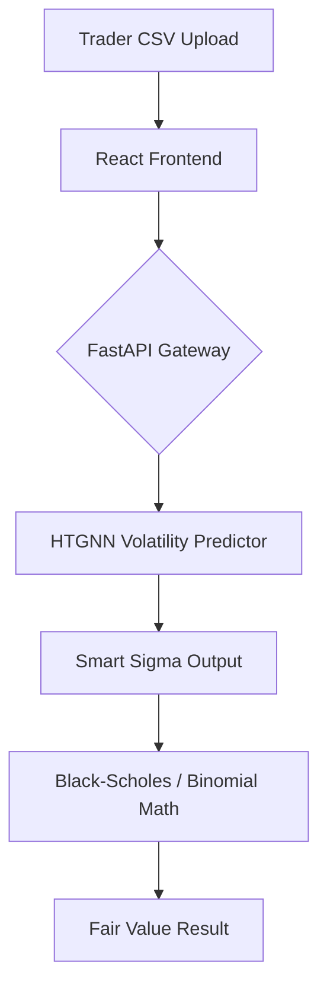

# OptionsPricingThroughGNN
This project deals with the pricing of European and American style options through the estimation of volatility through graph neural networks.

# 🚀 HTGNN-Pricing-Engine
### **State-of-the-Art Option Pricing via Hypergraph Temporal Graph Neural Networks**


## 📖 Project Vision
Standard models like Black-Scholes fail to capture the "Volatility Smile" because they assume constant volatility. This project implements a **Hypergraph Temporal Graph Neural Network (HTGNN)** to predict dynamic, fair-value Implied Volatility ($\sigma$). 

By training on the **Gauss314** dataset (3.5M rows), our model learns structural market relationships (Sectors) and temporal patterns (Market Stress) to provide traders with a competitive edge in European and American markets.

---

## 📐 System Architecture

Our platform utilizes a hybrid environment to balance AI compute power with UI responsiveness:

1.  **The Brain (Google Colab):**
    * **HTGNN Model:** Built with `PyTorch Geometric`.
    * **Data Scraper:** Real-time extraction via `yfinance`.
    * **The Bridge:** `FastAPI` hosted via `Ngrok` to serve predictions.

2.  **The Engine (VS Code / Local):**
    * **Frontend:** React (Vite) for a professional Trader Dashboard.
    * **Math Engines:** `jStat` for European (Black-Scholes) and custom iterative trees for American (Binomial).



---

## 🛠️ Installation

### Prerequisites
- Python 3.10+
- Node.js 18+
- npm or yarn

### Backend Setup
```bash
cd backend
pip install -r requirements.txt
uvicorn main:app --reload
```

### Frontend Setup
```bash
cd frontend
npm install
npm run dev
```

### Google Colab Setup
1. Open `colab/HTGNN_Model_Training.ipynb`
2. Install dependencies in the first cell
3. Run training or inference cells
4. Use Ngrok to expose FastAPI endpoint

---

## 📁 Project Structure

```
HTGNN-Pricing-Engine/
├── frontend/                 # React (Vite) Dashboard
│   ├── src/
│   │   ├── components/      # UI Components
│   │   ├── services/        # API Services
│   │   ├── utils/           # Pricing Calculators
│   │   └── App.jsx
│   └── package.json
├── backend/                  # FastAPI Server
│   ├── main.py              # API Endpoints
│   ├── pricing/             # Pricing Engines
│   │   ├── black_scholes.py
│   │   └── binomial.py
│   └── requirements.txt
├── colab/                   # Google Colab Notebooks
│   ├── HTGNN_Model_Training.ipynb
│   └── data_scraper.py
└── README.md
```

---

## 🎯 Features

- **Dynamic Volatility Prediction:** HTGNN learns from market structure and temporal patterns
- **European Options:** Black-Scholes pricing with predicted volatility
- **American Options:** Binomial tree pricing with early exercise
- **CSV Upload:** Batch process multiple option contracts
- **Real-time Data:** Integration with yfinance for live market data
- **Professional UI:** Modern React dashboard for traders

---

## 📊 Usage

1. **Train Model (Colab):**
   - Upload Gauss314 dataset or use scraper
   - Train HTGNN model
   - Export model weights

2. **Start Backend:**
   - Load trained model
   - Start FastAPI server
   - Expose via Ngrok if needed

3. **Use Frontend:**
   - Upload CSV with option parameters
   - Select European or American style
   - Get fair value prices with predicted volatility

---

## 🔬 Model Details

The HTGNN architecture:
- **Hypergraph Structure:** Captures sector relationships
- **Temporal Layers:** Models market stress over time
- **Output:** Implied Volatility ($\sigma$) for option pricing

---

## 📝 License

MIT License - See LICENSE file for details

---

## 🤝 Contributing

Contributions welcome! Please open an issue or submit a PR.
